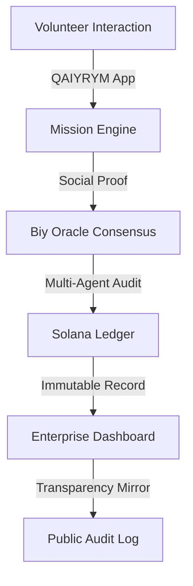

# 🪐 ProtoQol: Algorithm with a Conscience

### **The Decentralized Engine of Radical Transparency**
*Built for the Solana Decentralathon 2026*

---

## 🛰️ Ecosystem Overview
ProtoQol is a dual-layered integrity infrastructure designed to reclaim **Amanat** (trust) in the digital age. It connects grassroots humanitarian actions with enterprise-grade accountability.

1.  **QAIYRYM (B2C)**: A Telegram-based Mini App for volunteers. It uses gamification and reward systems to crowdsource social auditing.
2.  **ProtoQol Engine (B2B)**: A Zero-Trust oracle network that anchors social integrity proofs directly onto the Solana ledger.

---

## 🧬 Core Technology

### 1. **The Biy Oracle Consensus**
Traditional oracles only handle price data. The **Biy Oracle** uses a swarm of multi-agent AI (Gemini-powered) to reach consensus on real-world events (e.g., "Was the humanitarian aid delivered according to the mission rules?").
*   **Neutrality**: Each agent audits independently.
*   **Verification**: All audit logs are signed by the Master Authority.

### 2. **Solana Integrity Anchoring**
We use the Solana blockchain for its high-speed settlement and immutable state.
*   **SBT Integrity Proofs**: Audit results are minted as Soulbound Tokens (SBT) in the transparency mirror.
*   **Zero-Trust**: No single entity (even us) can alter the audit history once it hits the mainnet.

### 3. **Q-AI Compass**
Our proprietary navigation for social impact. It guides volunteers toward missions with the highest "Impact Density," calculated through real-time AI analysis of social needs.

---

## 🛠️ Architecture

---

## 🚀 Deployment
*   **Frontend**: Next.js + GSAP (Nomad Cyberpunk Style)
*   **Backend**: FastAPI + Multi-Agent Consensus Swarm
*   **Blockchain**: Solana (Master Authority Wallet)
*   **Live Hub**: [https://protoqol.vercel.app/hub.html](https://protoqol.vercel.app/hub.html)

---

## 🏆 Project Impact
ProtoQol solves the "Trust Gap" in ESG reporting and humanitarian aid. By replacing subjective "reports" with objective "on-chain proofs," we enable a new era of verifiable social accountability.

---
*Developed by Alikhan Particle (Sovushka0290) for Decentralathon 2026.*
