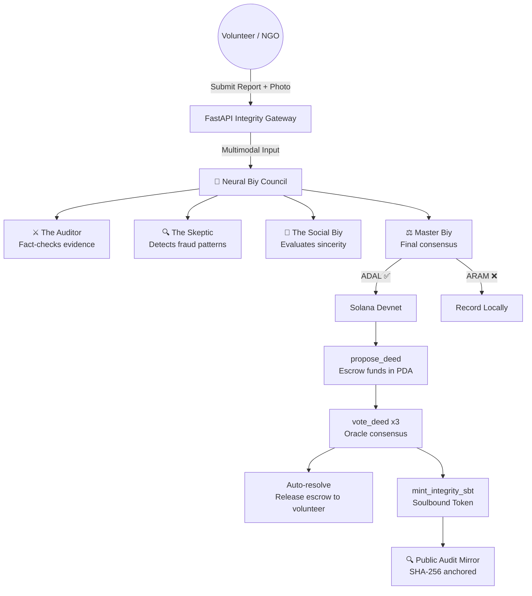

# 🛡️ ProtoQol: Autonomous AI Integrity Engine on Solana

<div align="center">
  
  
  
  
  
  

  <h3>Case 2: AI + Blockchain — Autonomous Smart Contracts</h3>
  
  <p><b>ProtoQol</b> is a decentralized integrity engine where an AI multi-agent swarm (the "Biy Council") autonomously verifies ESG and social impact claims, reaches consensus, and executes on-chain actions — escrow release, oracle voting, and Soulbound Token minting — without human intervention.</p>

  [🚀 Live Bot](https://t.me/qaiyrym_bot) • [📹 Demo Video](#)
  
  > **Note:** Backend runs locally. See [Quick Start](#-quick-start) to launch in 60 seconds.
</div>

---

## 🎯 Problem Statement

**ESG fraud (greenwashing) is a $540B problem.** Companies and individuals fabricate social impact reports to gain reputation, grants, and regulatory benefits. Traditional verification relies on:
- Manual auditors (slow, expensive, biased)
- Static smart contracts that can't evaluate qualitative evidence (photos, descriptions)
- Centralized decision-making with no transparency

**ProtoQol solves this** by making AI the autonomous oracle that drives on-chain state changes.

### Why existing approaches fail

| Approach | Limitation | ProtoQol |
|----------|-----------|----------|
| Manual audit firms | Slow (weeks), expensive ($5k+), subjective | AI Council: **<3 seconds**, $0.001/verification |
| Static smart contracts | Cannot evaluate text, photos, or intent | Gemini 2.0 Flash with multimodal input |
| Centralized AI (GPT wrappers) | No transparency, no on-chain proof | Every decision SHA-256 anchored on Solana |
| Self-reported ESG scores | Easily fabricated, no verification | Multi-agent adversarial consensus (Skeptic vs Auditor) |

### Business Model

ProtoQol targets the $540B ESG compliance market. B2B clients (NGOs, corporate CSR departments, government agencies) pay per-verification via API — same model as Stripe, but for social impact data integrity. See `/api/v1/etch_deed` for the enterprise endpoint.

---

## 🏛️ Architecture: AI → Decision → On-Chain Action



### The Autonomous Pipeline

| Step | Component | What happens |
|------|-----------|-------------|
| 1️⃣ | **User** | Submits impact report + photo via Telegram Mini App |
| 2️⃣ | **AI Council** | 4-agent swarm (Gemini 2.0 Flash) analyzes evidence |
| 3️⃣ | **Verdict** | AI decides `ADAL` (truthful) or `ARAM` (fraudulent) |
| 4️⃣ | **propose_deed** | Anchor smart contract creates PDA, escrows SOL reward |
| 5️⃣ | **vote_deed ×3** | AI oracle agents vote on-chain → auto-resolve at quorum |
| 6️⃣ | **mint_sbt** | Soulbound Integrity Token minted to volunteer (non-transferable) |
| 7️⃣ | **Audit Mirror** | Full AI dialogue anchored via SHA-256 hash, publicly verifiable |

> **Key insight:** Steps 3→7 happen **autonomously** — no human in the loop.

---

## ⛓️ Smart Contract (Anchor / Rust)

**Program ID:** [`EdrjHLN9K9eogJ5Pui8WYJRAghdN4knAdAoDcZesAirc`](https://explorer.solana.com/address/EdrjHLN9K9eogJ5Pui8WYJRAghdN4knAdAoDcZesAirc?cluster=devnet)  
**Network:** Solana Devnet  
**Status:** ✅ Pre-deployed — no Rust/Anchor toolchain needed to run the demo

### Instructions

| Instruction | Purpose | State Change |
|------------|---------|-------------|
| `initialize_protocol` | Bootstrap protocol stats PDA | Creates `ProtocolStats` account |
| `add_oracle` | Register AI agent as on-chain oracle | Creates `OracleRegistry` PDA |
| `propose_deed` | Create deed + escrow SOL reward | Creates `DeedRecord` PDA, transfers lamports |
| `vote_deed` | Oracle casts ADAL/ARAM vote | Increments vote counters, auto-resolves at 3 votes |

### On-Chain accounts

```rust
pub struct DeedRecord {
    pub nomad: Pubkey,          // Volunteer
    pub proposer: Pubkey,       // Foundation/B2B client
    pub mission_id: String,     // Campaign identifier
    pub reward_amount: u64,     // Escrowed SOL
    pub evidence_hash: String,  // SHA-256 of AI discussion
    pub votes_adal: u8,         // Positive votes
    pub votes_aram: u8,         // Negative votes
    pub resolved: bool,         // Auto-set at 3 votes
    pub timestamp: i64,         // On-chain clock
}
```

### Security constraints
- Oracle voting requires `oracle_registry.is_active == true` (PDA-verified)
- Protocol admin is hardcoded to a specific Pubkey (zero-trust)
- Deed accounts are PDA-derived from `[b"deed", deed_id]` — collision-resistant

---

## 🧠 AI Multi-Agent System ("Council of Biys")

The "Biy Council" is inspired by the Kazakh steppe tradition of **Zheti Zhargy** (Seven Laws), where a council of wise men (Biys) would deliberate and reach consensus.

| Agent | Role | Behavior |
|-------|------|----------|
| ⚔️ **The Auditor** | Fact-checker | Verifies photographic evidence and object detection |
| 🔍 **The Skeptic** | Fraud detector | Searches for stock images, AI-generated content, recycled reports |
| 🤝 **The Social Biy** | Impact evaluator | Assesses "Asar" (communal spirit), calculates social impact score |
| ⚖️ **Master Biy** | Consensus judge | Synthesizes all reports into final `ADAL` or `ARAM` verdict |

### Technical Details
- **Model:** Gemini 2.0 Flash (optimized for speed — target <2.5s response)
- **Multimodal:** Accepts text descriptions + photo evidence (base64 PNG)
- **Mode switching:** `REAL_MISSION` (strict) vs `SHOWCASE_DEMO` (lenient for demo)
- **Integrity anchor:** SHA-256 hash of the raw AI response = `integrity_hash`
- **API key rotation:** Round-robin pool to prevent 429 rate limits
- **Resilience:** Hard timeout (30s) + automatic fallback to `REVIEW_NEEDED`

---

## 📡 Live On-Chain Proof

> **End-to-end example:** AI decision → smart contract state change → SBT mint

```
Input:   "Delivered food to 3 elderly residents in Aktobe"
AI:      ADAL (auditor: PASS, skeptic: CLEAN, asar: 0.87)
Deed TX: propose_deed → vote_deed ×2 → DeedRecord.resolved = true
SBT:     mint_integrity_sbt → 1 token, authority revoked (soulbound)
```

**Verify on-chain:**
- [View deployed program on Solana Explorer ↗](https://explorer.solana.com/address/EdrjHLN9K9eogJ5Pui8WYJRAghdN4knAdAoDcZesAirc?cluster=devnet)

<!-- Live test completed. Real hashes from ProtoQol Engine: -->
- [View Deed Proposed TX ↗](https://solscan.io/tx/4DuZMAkH1FTueetgB4AExC5hLFnsPf7jTjJWYNRkVPfzcyqCukcohXpod3XncKJJrwFubsp1upAzHB3udqfxNdit?cluster=devnet)
- [View AI Biy Oracle Vote TX ↗](https://solscan.io/tx/3atA1kXGLSE41M2V5QHzYfAaqPL9X3uP9Bgm6kjxfAxrqzxsuJ5WcGUPMtwfuPxwgoCXm9AYnvzfaMvXkNioYwZX?cluster=devnet)

## 🏦 Soulbound Integrity Token (SBT)

After a positive `ADAL` verdict, the system **autonomously mints** a Soulbound Token:

1. **SPL Token Mint** with 0 decimals (NFT)
2. **Associated Token Account** created for the volunteer
3. **Exactly 1 token** minted
4. **Mint authority revoked** → no more can ever be created
5. Token is permanently bound to the volunteer's wallet

This creates an **immutable, on-chain proof of verified social impact**.

---

## 🚀 V2 Architecture: 100% Zero-Trust & Cryptographic Proof of Impact

While the current version anchors the final decision hash in Solana, **V2 scales this to a billion-dollar enterprise B2B verification infrastructure**. To achieve absolute Verifiability, we are implementing a deterministic Hash Chain stored on IPFS/Arweave.

Instead of writing just the final report, V2 uses a cryptographic waterfall:

```javascript
evidence_hash = SHA256(photo_bytes + description + timestamp)
ai_hash = SHA256(ai_raw_response)
consensus_hash = SHA256(evidence_hash + ai_hash + verdict + mission_id)
```

**The Mechanics:**
1. **Solana Layer:** We only write the `consensus_hash` and the `IPFS_CID` to the blockchain (saving gas).
2. **IPFS/Arweave Layer:** We store the raw JSON mapping containing all evidence bytes, "Biy Council" deliberation logs, and AI signatures.
3. **The Business Value:** Any external B2B sponsor, NGO, or independent auditor can pull the JSON from IPFS, locally recalculate the hashes, and compare them against the immutable `consensus_hash` in Solana. 

This mathematical proof guarantees that **the evidence was not tampered with before reaching the AI**, and **the AI's verdict was not manipulated by intermediate backend layers**. It is a mathematically proven, 100% trustless audit trail. See [AI-SPEC.md](./AI-SPEC.md) for deeper implementation details.

---

## 🗄️ Account Abstraction (Shadow Wallets)

Users interact via Telegram — they never see Solana keypairs:

```python
def get_nomad_wallet(user_id: str):
    seed = SHA256(f"{user_id}::{WALLET_SALT}")
    return Keypair.from_seed(seed)
```

Each Telegram user gets a **deterministic**, invisible Solana wallet. Gas is sponsored by the protocol's Master Authority.

---

## 🚀 Quick Start

> **Prerequisites:** Python 3.10+ and a Gemini API key. That's it.  
> The Anchor smart contract is **pre-deployed on Devnet** — you don't need Rust, Anchor CLI, or Solana tools.

### 1. Clone & Configure
```bash
git clone <repo-url>
cd ProtoQol
cp .env.example .env
# Add your GEMINI_API_KEY to .env (required)
# BOT_TOKEN is optional — only needed for Telegram bot
```

### 2. Install Dependencies
```bash
pip install -r requirements.txt
```

### 3. Launch Backend
```bash
python -m uvicorn main:app --host 0.0.0.0 --port 8000 --reload
```

### 4. Test the Pipeline
```bash
curl -X POST http://localhost:8000/api/v1/verify_mission \
  -H "Content-Type: application/json" \
  -d '{
    "description": "Delivered groceries to elderly woman in Aktobe.",
    "user_id": "test_nomad_001",
    "mission_id": "elders_aktobe",
    "mode": "REAL_MISSION"
  }'
```

### 5. Verify On-Chain
Open the `integrity_hash` from the response and visit:
```
http://localhost:8000/audit/<integrity_hash>
```
This opens the **Public Audit Mirror** — a full cyberpunk-styled log of the AI Council deliberation.

To verify the smart contract on-chain independently:
[🔍 View Program on Solana Explorer ↗](https://explorer.solana.com/address/EdrjHLN9K9eogJ5Pui8WYJRAghdN4knAdAoDcZesAirc?cluster=devnet)

---

## 📁 Project Structure

```
ProtoQol/
├── main.py                    # FastAPI Integrity Gateway (entry point)
├── core/
│   ├── ai_engine.py           # Unified Biy Council (Gemini 2.0 Flash)
│   ├── ai_consensus.py        # CrewAI multi-agent orchestration (legacy)
│   ├── solana_client.py        # Anchor RPC + SBT Minting + Shadow Wallets
│   ├── database.py            # SQLite WAL persistence layer
│   ├── config.py              # Engine configuration + API key rotation
│   ├── guardian.py            # Rate limiting (IP-based)
│   ├── exceptions.py          # Custom error hierarchy
│   ├── event_monitor.py       # Autonomous on-chain event listener
│   └── webhooks.py            # B2B webhook dispatcher
├── routes/
│   ├── oracle.py              # Protocol verification endpoint
│   └── gateway.py             # B2B enterprise API gateway
├── protoqol_core/             # Anchor smart contract (Rust)
│   └── programs/protoqol_core/src/lib.rs
├── dashboard.html             # Enterprise Command Center UI
├── index.html                 # Landing page (Nomad Cyberpunk theme)
├── requirements.txt           # Python dependencies
└── .env.example               # Environment template
```

---

## 🛡️ Security & Trust Model

- **API keys injected via `.env`** — Gemini keys, bot tokens, and wallet salts are never committed to the repo
- **Demo API whitelist** — `PROTOCOL_API_WHITELIST` contains hardcoded demo keys for hackathon testing (would be moved to DB/env in production)
- **Deterministic wallets** — SHA-256 derived from Telegram ID + salt, no key files stored
- **On-chain authorization** — Oracle voting requires PDA-verified `is_active == true`
- **Integrity anchoring** — Every AI decision is SHA-256 hashed before on-chain settlement
- **No PII on-chain** — Only hashes and Pubkeys are stored on the public ledger
- **Rate limiting** — IP-based in-memory limiter protects AI/Solana budget during demos

---

## 📊 Evaluation Criteria Mapping

| Criteria | Points | How ProtoQol addresses it |
|----------|--------|--------------------------|
| **Product & Idea** | 20 | Solves real $540B greenwashing problem with cultural "Asar" narrative |
| **Technical Implementation** | 25 | Working MVP: FastAPI + 4-agent AI + Anchor smart contract + SQLite |
| **Use of Solana** | 15 | PDA escrow, oracle voting, auto-resolution, SBT mint, explorer links |
| **Innovation** | 15 | First "Ethics as a Service" protocol with nomadic AI consensus metaphor |
| **UX & Product Thinking** | 10 | Telegram Mini App + Account Abstraction = zero-friction onboarding |
| **Demo & Presentation** | 10 | Showcase Mode, Public Audit Mirror, real-time dashboard |
| **Completeness & Documentation** | 5 | This README, inline code docs, .env.example |

---

<div align="center">
  <p>Built for <b>Decentrathon — National Solana Hackathon 2026</b></p>
  <p><i>"The truth doesn't need to be loud, it just needs to be on the blockchain."</i></p>
  <br>
  <p align="center">
    <b>Built for the National Solana Hackathon by Decentrathon</b><br>
    <i>Case 2: Tokenization of Real-World Assets (Autonomous Smart Contracts)</i><br>
    <b>Copyright (c) 2026 Alikhan Bakhtybay. All rights reserved.</b>
  </p>
  <p>Solo Founder • 17 years old • Aktobe, Kazakhstan 🇰🇿</p>
</div>
